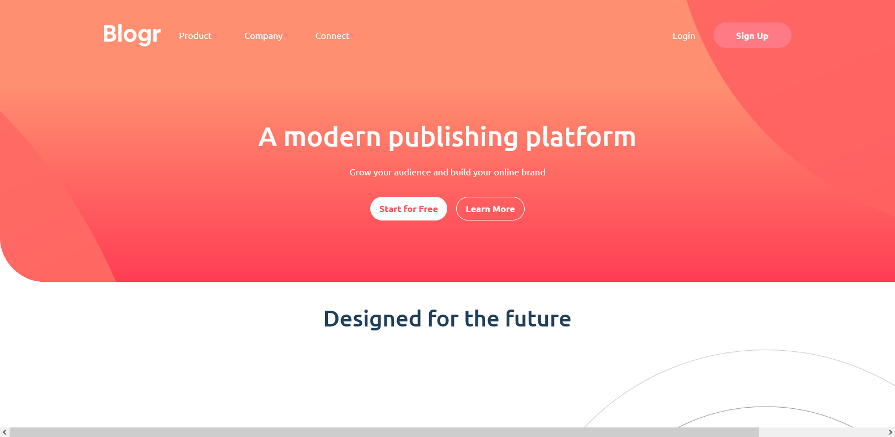

# Frontend Mentor - Blogr landing page solution

This is a solution to the [Blogr landing page challenge on Frontend Mentor](https://www.frontendmentor.io/challenges/blogr-landing-page-EX2RLAApP). Frontend Mentor challenges help you improve your coding skills by building realistic projects. 

## Table of contents

- [Overview](#overview)
  - [The challenge](#the-challenge)
  - [Screenshot](#screenshot)
  - [Links](#links)
- [My process](#my-process)
  - [Built with](#built-with)
  - [What I learned](#what-i-learned)
  - [Continued development](#continued-development)
  - [Useful resources](#useful-resources)
- [Acknowledgments](#acknowledgments)


## Overview

### The challenge

Users should be able to:

- View the optimal layout for the site depending on their device's screen size
- See hover states for all interactive elements on the page

### Screenshot




### Links

- Solution URL: [Github Repo Link](https://github.com/qayoommunawar/Bloggr-Fully-Responsive-Landing-Page)
- Live Site URL: [Github Live Page](https://qayoommunawar.github.io/Bloggr-Fully-Responsive-Landing-Page/)

## My process

### Built with

- Semantic HTML5 markup
- CSS custom properties
- Flexbox
- CSS Grid
- Mobile-first workflow
- Vanill JavaScript


### What I learned

I practiced js to create responsive mobile navbar while still can not create for desktop.

To see how you can add code snippets, see below:


```
```js
// Define media query for 680px
const mediaQuery = window.matchMedia('(max-width: 779px)');

// Only toggle mobile nav when screen is below 680px
toggleButton.addEventListener('click', () => {
  if (mediaQuery.matches) {
    mobileNav.classList.toggle('active');
    toggleIcon.src = mobileNav.classList.contains('active') 
      ? 'images/icon-close.svg' 
      : 'images/icon-hamburger.svg';
  }
});
```


### Continued development

- Desktop navabar is not completed.
- Infrastructure section background is not working properly, i was not able to create background as per design requirements.


## Acknowledgments

Very thankful to frontend community and particulary @marziajalil for making it to work so far.